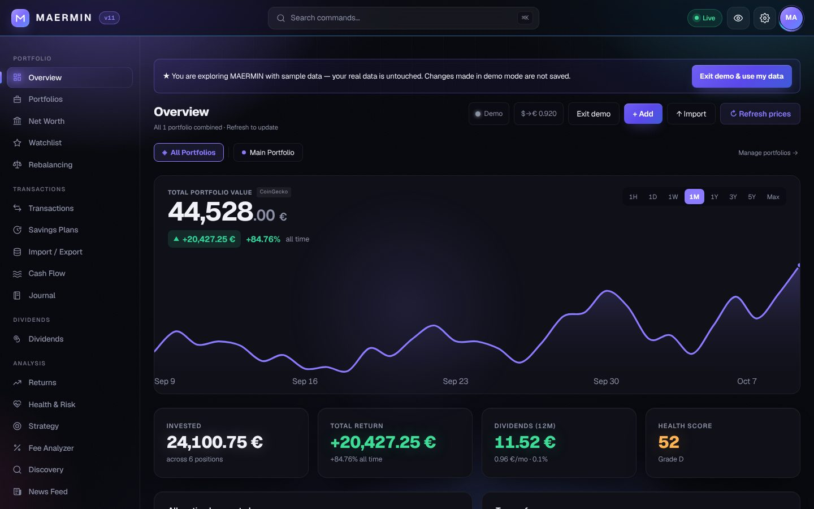
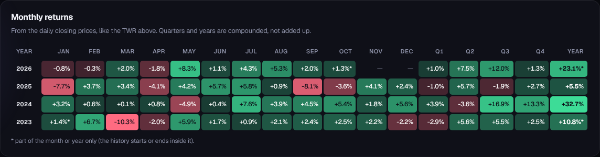
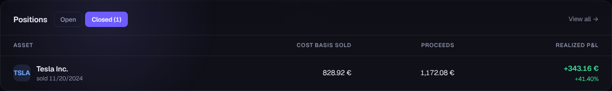
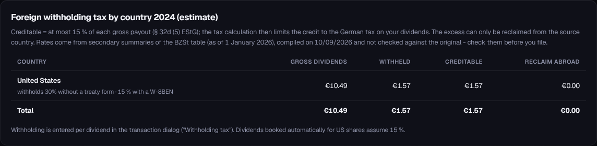
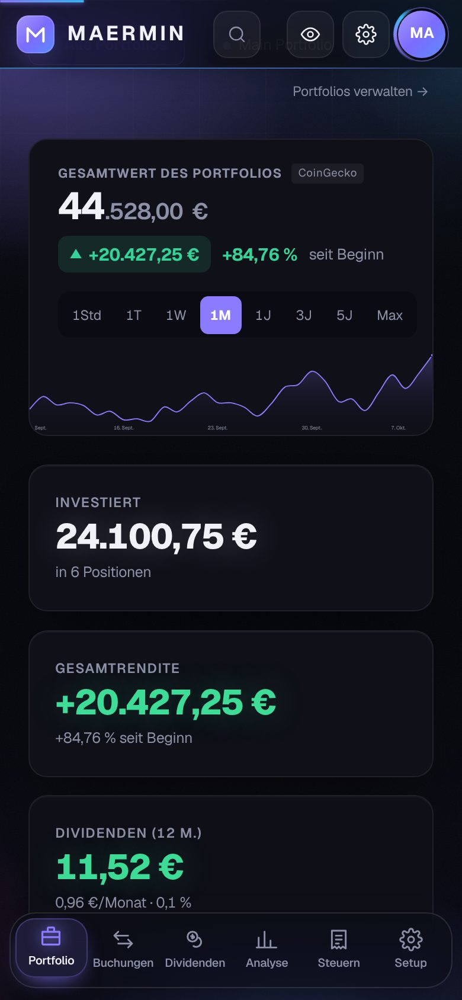

<div align="center">

# MAERMIN

**Professional Multi-Asset Portfolio Tracker**

Crypto · Stocks · ETFs · CS2 Skins · Commodities

[](https://maermin.github.io/MAERMIN/)
[](#changelog)
[](LICENSE)
[](#privacy--security)
[](#privacy--security)

<br>

> **All your assets in one place. Runs in your browser, prices through your own free Cloudflare Worker. No signup. No tracking.**

</div>

---

## What is MAERMIN?

MAERMIN is a **client-side** investment tracker that runs in your browser with no installation. Your data is stored in this browser (`localStorage` and IndexedDB). Market data comes through your own Cloudflare Worker, which receives only the symbols you hold — no amounts, no quantities. Sync and sharing are opt-in; what leaves the device is listed under [Privacy & Security](#privacy--security). Access is protected by an **encrypted vault**: an access password derives an AES-256-GCM key (PBKDF2-600k; Argon2id only if a provider is registered — none is bundled) via `crypto-vault.js`; the password is never stored, and sensitive data can be encrypted at rest. Optional passkey unlock (WebAuthn) and an idle auto-lock are built in.

Built with React (via CDN) and vanilla JavaScript. No build step required for development, no framework to install. Works offline after the first load (PWA), with the last loaded prices. A local audit log records security events and uncaught errors on-device.

```
No MAERMIN account  ·  No MAERMIN server  ·  No ads  ·  No remote telemetry  ·  MIT License
```

> Privacy note: there is **no remote telemetry**. The on-device "Security log" (Settings → Security log) stays in your browser and is never transmitted.

---

## Screenshots

<p align="center"></p>

| Monthly returns | Closed positions |
|---|---|
|  |  |
| **Withholding tax by country** | **Phone (German)** |
|  |  |

All pictures show the built-in demo (Demo mode, made-up data), v11.0.

---

## How MAERMIN compares

What the other products say about themselves, read on **3 October 2026** from the pages linked below; "n/s" = not stated there. MAERMIN's column describes v11.0.

| | MAERMIN | Parqet | getquin | Portfolio Performance | Ghostfolio | Wealthfolio |
|---|---|---|---|---|---|---|
| Where your data lives | This browser, encrypted vault | Provider cloud | Provider cloud | Local file | Your server (self-host) or hosted | On your device |
| Price | Free, MIT | Free; Plus €11.99/mo; Investor €29.99/mo | n/s | Free, EPL | AGPL; Premium price n/s | Free; paid Connect |
| Live prices without setup | No — needs your own free Cloudflare Worker (about 5 minutes; the demo works without) | Yes | Yes | Yes (desktop app) | Hosted: yes; self-host needs Postgres + Redis | Yes |
| File import | ~15 CSV formats incl. Portfolio Performance and Parqet, PDF statements of 5 banks/brokers | 50+ brokers, PDF/CSV | PDF + manual | PDF from 90+ banks/brokers | Import/export | CSV |
| German tax | FIFO, Vorabpauschale, Teilfreistellung, Anlage KAP, withholding by country | Tax dashboard (Plus) | n/s | Taxes recorded | n/s | n/s |
| Device sync | End-to-end encrypted, through your own Worker | Cloud | Cloud | File-based | Server | Paid encrypted sync |
| Mobile | PWA | iOS / Android | iOS / Android | iOS / Android | PWA | iOS / Android |

Sources (read 2026-10-03): [Parqet pricing](https://parqet.com/pricing) · [Parqet review, etf.capital](https://etf.capital/parqet-app/) · [getquin](https://www.getquin.com/) · [getquin review, etf.capital](https://etf.capital/getquin-app/) · [Portfolio Performance](https://www.portfolio-performance.info/en/) · [its PDF import manual](https://help.portfolio-performance.info/en/reference/file/import/pdf-import/) · [Ghostfolio README](https://github.com/ghostfolio/ghostfolio) · [Wealthfolio](https://wealthfolio.app/). Prices and features change; check the linked pages before you decide.

---

## Features

### Portfolio
| Feature | Description |
|---------|-------------|
| **Overview** | Stats cards showing all portfolios combined — total value, invested, return, positions |
| **Portfolio History Chart** | Real historical data from Yahoo Finance · CoinGecko, CS2 trend from the daily Steam Market price list — 1H · 1D · 1W · 1M · 1Y · 3Y · 5Y · Max |
| **Symbol Picker** | Visual search for stocks (Yahoo Finance logos + exact YF symbol) and crypto (CoinGecko IDs) |
| **CS2 Skin Picker** | Search every CS2 item with picture and Steam Market price — auto-fills transaction |
| **Positions Table** | Value, weight and P&L per holding — click any row for the position detail modal (transactions, avg cost, CAGR, stock splits, investment journal) · **Open / Closed** switch: closed positions with cost basis sold, proceeds, realized P&L and return from the FIFO ledger · price chart with average-cost line in the position dialog |
| **Multi-Portfolio** | Multiple portfolios with colour coding — the Overview shows all portfolios combined or one at a time (portfolio chips) |
| **Net Worth** | Add cash accounts, real estate, loans — see true net wealth beyond investments · **real assets & property** with valuation history, acquisition cost+fees, optional financing link and recurring/one-off cashflows (net value + net rental yield + total return) · **interest-bearing cash & time deposits** (Festgeld): rate, daily/monthly/annual compounding, maturity — interest accrues day-accurate (act/365) and is booked as capital income for the tax report |
| **Options** | Track long/short calls and puts (underlying, strike, expiry, premium, contract size) — signed book with net premium, moneyness, intrinsic value and estimated P&L on the Overview; kept separate from the share positions |
| **Dividends** | Calendar view, 12-month forecast, auto-fetch from Yahoo Finance · quality & safety scoring per payer (payout ratio, growth streak, dividend growth, coverage, cut-risk flag) with an aggregated portfolio dividend-health value · **yield-on-cost** per payer over the FIFO cost basis plus a **DRIP simulation** (reinvest distributions at the day's price vs cash — a simulation, never books real transactions) |
| **Trade Journal** | Investment thesis and notes per position |

### Analysis
| Feature | Description |
|---------|-------------|
| **Returns & XIRR** | Money-weighted (XIRR) and time-weighted return from real cash flows · benchmark overlay (Alpha, Beta, Tracking Error, Information Ratio, R² vs MSCI World / FTSE All-World / S&P 500 / Nasdaq 100) · FX attribution splitting each return into asset (local) and exchange-rate parts, aggregated by currency · **monthly returns heatmap** (month × year, compounded quarters and years) |
| **Rebalancing** | Set target allocation via sliders — see exactly what to buy/sell · tolerance band per target, **invest-only mode** (spread new money, never sell) and never-sell holdings |
| **Savings Plans** | DCA adherence tracking (calendar-exact schedules), missed executions, plan performance · due executions are booked automatically as real, marked buy transactions on app open (idempotent, sync-safe) · optional end date with active/completed status · add/edit in a modal |
| **Cash Flow** | Invested vs portfolio value chart — visualises your entire investment journey |
| **Fee Analyzer** | Total fees, fee rate %, breakdown by year and asset class, top 10 most expensive trades · ongoing costs (TER) per fund with annual EUR cost, weighted average TER, multi-year cost-drag projection, and manual TER override |
| **Risk & Correlation** | Correlation matrix, Monte Carlo (10,000+ iterations), stress tests (2008 / COVID / Dot-com), VaR, CVaR, Sharpe, Sortino · rolling volatility/return trends · Fama-French factor exposure (market / size / value loadings) |
| **Planning Simulator** | Future Value · FIRE projection · withdrawal survival · Monte-Carlo success probability — in the Monte-Carlo view · allocation backtester: what would X EUR in a freely defined allocation have become over real history, with optional periodic rebalancing, vs benchmark presets and your actual portfolio |
| **Strategy** | DCA vs lump sum, sector allocation, currency exposure, **company-size buckets** (Large/Mid/Small, EUR-normalised market cap), liquidity score, goal planning |
| **Performance Map** | Allocation treemap heatmap — area = position weight, colour = performance (remaps across themes); period selector with total-return fallback; respects Privacy Mode (in the Performance view) |
| **Health Score** | 0–100 structural score (diversification · concentration · asset-class spread · breadth) with a letter grade and concrete, actionable recommendations · advisor findings folded in |
| **ETF X-Ray** | Look-through of ETF/fund positions: effective per-security exposure across funds + direct holdings, sector/country/currency look-through, fund-overlap detection, hidden concentration risks — in the Health and Risk views (live via Worker, built-in snapshot fallback) |
| **Corporate Actions** | Stock splits and reverse splits applied to historical lots so quantities, prices, position value, P&L, CAGR, the value chart and FIFO cost basis stay correct across a split · add manually (ratio New:Old) per holding or auto-detect via the Worker · managed in the position detail modal, with a global list in Settings · carried in the full-vault backup |
| **Steam inventory import** | Data → Steam inventory: the CS2 items of a public inventory (SteamID64, profile URL or custom URL name, through your Worker — or paste the inventory JSON) become buys in an editable preview, prices pre-filled with today's Steam Market price · a re-import only offers items not imported before (asset ids) · never books sales |
| **Trash & Undo** | Deleted transactions, portfolios, savings plans, net-worth accounts, goals, rules and real assets go to a trash for 30 days · every delete toast offers **Undo** · Settings → Trash restores or deletes for good · encrypted, synced and in the full backup; a restore never creates a duplicate |
| **Tax & FIFO** | German tax law: 1-year crypto exemption with Freigrenze, Vorabpauschale per accumulating fund (BMF base rates, month pro-rating, sale credit), Teilfreistellung by fund type, Sparerpauschbetrag, Soli and optional church tax in the statutory order · US tax law (short/long-term gains) · editable tax settings (rate, Soli, church tax, allowance, crypto exemption, Teilfreistellung) · multi-sheet Excel + PDF export · **tax advisor** (estimate): crypto §23 EStG tax-free countdown per lot, 1.000 EUR Freigrenze buffer, Sparerpauschbetrag headroom, loss-harvesting with the stock vs other pots kept separate, ranked Critical/Important/Optimization · **foreign withholding tax by country** (gross, withheld, creditable at most 15 %, excess to reclaim abroad; estimate) |

### Tools
| Feature | Description |
|---------|-------------|
| **Portfolio Intelligence** | Automatic detection of structural problems across ten dimensions — hidden concentration, single-company & sector overexposure, country & currency risk, correlation clusters (fund overlap), style drift, dividend & yield traps, liquidity risk — each with a concrete recommendation, ranked **Critical / Important / Optimization**. Reuses the ETF look-through, metrics and dividend engines; computed fully on-device (`g i`) |
| **Discovery** | Read-only screener for ETFs/stocks/crypto · top movers (gainers/losers/most active) · dividend screener — live via your Worker, prices shown in EUR. Gated & optional; degrades gracefully if the Worker predates the endpoint |
| **Watchlist** | Track symbols without buying — optional target price and sparkline |
| **Alerts & Rules** | "Warn me when…" rules on price (e.g. BTC ≥ 70,000), symbol/category/tag weight, total value and drop from peak — evaluated on every price refresh on any screen, with toast + optional local notification · older price alerts are migrated automatically |
| **Risk Monitor** | Rule-based structural alerts with configurable thresholds — position concentration (incl. effective look-through limit), allocation drift, drawdown, volatility — evaluated on every price refresh, with optional local notifications and cooldown |
| **Broker Import** | CoinTracking · DEGIRO · Trade Republic · Scalable Capital · Interactive Brokers · Trading 212 · Revolut · flatex · Consorsbank · Coinbase · Binance · Kraken · Bitpanda · PDF settlement statements (Trade Republic, Scalable, ING, DKB, Comdirect) parsed fully on-device with editable preview - the PDF never leaves your browser · **reusable mapping presets** — save a column mapping for an unknown broker and re-import next time without remapping · **read-only exchange sync** (Binance · Kraken · Coinbase · Bitpanda) over the client-signed relay — read-only API keys stored only in the encrypted vault, idempotent (no duplicate trades), manual trigger · **Portfolio Performance** (CSV export, English or German) and **Parqet** (activities export) |
| **Command Palette** | `Ctrl+K` — navigate anywhere by keyboard |
| **Privacy Mode** | Mask every amount app-wide for screenshots / public viewing — toggle in the top bar, in Settings, or with `p` |
| **Share & Compare** | Opt-in redacted snapshot sharing (percentage weights and scores only - never amounts, quantities or symbols; enforced client- and server-side) with 90-day links, plus anonymous benchmarking against the aggregate of all shared snapshots · the same link backs a read-only **MCP endpoint** ("Ask Claude about your portfolio") that exposes only the redacted allocation/scores |
| **Keyboard Shortcuts** | `g`+key to jump views (`g o`, `g t`, …), single keys for actions (`n` new · `r` refresh · `b` backup · `i` import · `p` privacy) · `?` shows the full list |

---

## Quick Start

### 1 — Open the app
```
https://maermin.github.io/MAERMIN/
```
On first run you **set your own access password** (no shipped default) and are handed a
one-time **recovery code** — download or print it. It's an alternative way to unlock the
vault if you forget your password, stored only as a wrapped key (never in readable form,
never transmitted). The first run also opens a **guided setup wizard** (below); you can
re-open it anytime from **API Settings → Guided setup**, or pick **Demo mode** to explore
a sample portfolio before any setup. The demo brings its own made-up daily prices, so the
value chart, TWR, the monthly returns grid, closed positions and the withholding-tax table
all work without a Worker; leaving the demo shows your own (untouched) data again.

### 2 — Deploy your Cloudflare Worker
The Worker is **required** for stock prices, historical chart data, CS2 prices, and symbol search. It's free and takes ~2 minutes.

[](https://deploy.workers.cloudflare.com/?url=https://github.com/Maermin/MAERMIN/tree/main/cf-worker)

1. Click **Deploy to Cloudflare**, sign in (free account) and confirm. Cloudflare copies `cf-worker/` into a repository in your GitHub account, creates the KV namespace for sync and deploys the Worker.
2. Copy the Worker URL shown at the end (`https://….workers.dev`).
3. Paste it in MAERMIN → **API Settings** → Cloudflare Worker, or let the in-app **guided setup wizard** test and save it. The wizard's connection test checks each data source and the Worker version.

**By hand (fallback):** [dash.cloudflare.com](https://dash.cloudflare.com) → **Workers & Pages** → **Create Worker** → paste [`cf-worker/worker.js`](cf-worker/worker.js) → **Deploy** (the wizard has a *Copy worker.js* button). Or run `npx wrangler deploy` in `cf-worker/` (wrangler 4.45 or later).

**Updating:** the app asks the Worker for its version (`?action=version`). When the Worker is older than the release expects, the overview shows **Worker outdated → update**, and API Settings lists the steps: open your Worker in the Cloudflare dashboard → **Edit code** → paste the new `cf-worker/worker.js` → **Deploy**. If you used the button, you can instead update `worker.js` in the repository it created; Cloudflare redeploys on every push.

---

## Data Sources

| Source | Used For | Key Required |
|--------|----------|:------------:|
| **Yahoo Finance** | Stocks, ETFs, commodities, all global exchanges, historical data | ✗ (via Worker) |
| **CoinGecko** | Crypto prices + history | ✗ (via Worker; optional `COINGECKO_API_KEY` demo key raises the limit) |
| **CSGO Trader price file** | CS2 skin prices — daily Steam Market averages (24 h / 7 / 30 / 90 days) for every item, one request | ✗ (via Worker) |
| **ByMykel CSGO-API** | CS2 item pictures — bundled as `data/skin-images.json` (`node scripts/build-skin-images.mjs` refreshes it) | ✗ |
| **ExchangeRate-API** | USD → EUR conversion | ✗ |
| **Cloudflare Worker** | CORS proxy for all Worker endpoints | ✗ (free tier) |

---

## Cloudflare Worker Endpoints

| Endpoint | Description |
|----------|-------------|
| `GET /?action=yf&symbol=AAPL&interval=1d&range=1y` | Yahoo Finance historical data |
| `GET /?action=yfsearch&q=Apple&type=stock` | Symbol search (stocks or crypto) |
| `GET /?action=cg&p=simple/price&ids=bitcoin&vs_currencies=eur` | CoinGecko (prices, coin search, history); cached, unknown coins remembered, last good copy on a rate limit |
| `GET /?action=screener&scrId=day_gainers` (or `&symbols=KO,PG`) | Discovery: predefined screener / movers, or batch quote |
| `GET /?action=fundholdings&symbol=VWCE.DE` | ETF/fund look-through: top holdings, sector weights, expense ratio (TER) |
| `GET /?action=fundamentals&symbol=KO` | Dividend-safety fundamentals: payout ratio, EPS, dividend rate/yield |
| `GET /?action=profile&symbol=AAPL` | Equity sector / industry / country (Strategy tab Sector & Country allocation; Yahoo `assetProfile`, no FMP key needed) |
| `GET /?action=earnings&symbol=AAPL` | Next earnings date + consensus EPS/revenue estimates (Earnings Calendar in the Dividends view; Yahoo `calendarEvents`, no key) |
| `GET /?action=news&symbol=AAPL` | Yahoo Finance RSS headlines for a holding (News Feed view) |
| `GET /?action=skinprices` | CS2 Steam Market prices for every item (USD, daily file, cached 1 h) |
| `GET /?action=steaminv&profile=<id\|url>` | CS2 items of a public Steam inventory (Steam inventory import; Steam may throttle cloud IPs, the app then offers to paste the inventory JSON) |
| `GET /?action=version` | `{ version, actions }` — the app compares the version with the one its release expects and asks you to update an older Worker |
| `POST /?action=sync` | E2E-encrypted cloud sync (Durable Object storage, KV as fallback; the Worker sees only ciphertext, an anonymous account id and the revision) |
| `POST /?action=share` | Redacted share snapshots (percent weights/scores only, allowlist-validated server-side) + anonymous benchmark aggregate |
| `GET /?action=mcp&id=<shareId>` | Read-only MCP view of a shared, redacted snapshot (same allowlist, same 90-day link) |
| `POST /?action=brokerproxy` | Relay read-only requests to whitelisted exchanges (the API key travels in the request header; Binance requests are signed in the browser, the secret never leaves it) |

All endpoints are rate-limited (per-IP) and use hard fetch timeouts. Full request/response contracts: [docs/WORKER.md](docs/WORKER.md).

---

## File Structure

```
MAERMIN/
├── index.html                  Entry point — loads all scripts in order, sets CSP
├── styles.css                  App styles
├── audit-log.js                Security/error audit trail (window.MaerminAuditLog)
├── crypto-vault.js             AES-256-GCM vault, KDF, passkeys (window.MaerminVault)
├── storage.js                  Encrypted-at-rest storage shim + backups (window.MaerminStorage)
├── migrations.js               localStorage schema migrations (window.MaerminMigrations)
├── auth.js                     Vault unlock/setup gate (window.MaerminAuth)
├── utils.js                    Shared formatters, upsertTransaction, FX (window.MaerminUtils)
├── ledger.js                   The one FIFO lot ledger: cost basis, disposals (window.MaerminLedger)
├── metrics.js                  Shared metrics: positions, net worth, FIRE (window.MaerminMetrics)
├── portfolio-intelligence.js   Ten-check structural problem detection, ranked (window.MaerminIntelligence)
├── ticker-validation.js        Symbol normalisation (window.MaerminTickers)
├── equity-metadata.js          Sector/country metadata (window.MaerminEquityMeta)
├── dividend-data-service.js    Dividend data + forecast (window.DividendDataService)
├── tax-report-builder.js       Filing-grade tax report + PDF/Excel (window.MaerminTaxReport)
├── projection.js · recurring.js  Forecast / liabilities engines
├── renderer.js                 Main React app — state, routing, transactions (~5,400 lines)
├── features.js … features7.js  Feature views (charts, analysis, dividends, net worth, …)
├── build.mjs                   Web build — bundles + minifies (reads index.html order)
├── test/                       Node test harnesses (npm test)
├── docs/                       ARCHITECTURE.md · WORKER.md
└── cf-worker/worker.js         Cloudflare Worker — market-data proxy, sync, broker relay
```

> Full module/view map and data flow: **[docs/ARCHITECTURE.md](docs/ARCHITECTURE.md)**.

### Development

The app runs directly from `index.html` (no build needed for dev). Common scripts:

```bash
npm install        # once, pulls esbuild (web build)
npm test           # run all Node test harnesses (test/*.test.js)
npm run check      # syntax-check every JS file (fast pre-commit gate)
npm run build:web  # -> dist/index.html + dist/maermin.min.js + dist/styles.css
npm run test:e2e   # headless Chromium smoke test of index.html + dist/ (after build:web)
```

Contributing guidelines and conventions: **[CONTRIBUTING.md](CONTRIBUTING.md)**.

---

## Privacy & Security

- All data is stored in this browser; with encryption at rest on (the default for a new vault) your financial records are encrypted, a few settings (tax settings, FX history, the security log) are not. What leaves the device (market-data requests, opt-in sync and sharing) is listed in-app under **Settings → Privacy** and below
- **Encrypted vault**: AES-256-GCM with PBKDF2-600k; password never stored; optional encryption at rest, passkey unlock, idle auto-lock
- **Recovery code**: a one-time code generated at setup is an alternative way to unlock the vault if you forget your password — implemented as a second key-wrapping (like a passkey), never stored in readable form and never transmitted, so the zero-knowledge model is preserved. Changing your password invalidates it; generate a fresh one afterwards.
- **Encrypted backups**: export a portable, password-protected backup (Settings → Backup vault) — a portable recovery path you can store off-device
- **On-device audit log**: security events + uncaught errors (Settings → Security log), never transmitted
- No analytics, no remote telemetry, no third-party tracking; the fonts (Geist) are self-hosted
- Data requests go to: open.er-api.com (the USD rate, no portfolio data) and your own Cloudflare Worker (which asks Yahoo Finance, CoinGecko and the CSGO Trader price file); the app checks the Worker once a minute while open
- Code from CDNs (version-pinned, SRI-checked): React from unpkg.com on the first start and after an update (otherwise from the offline cache); jsPDF and pdf.js from cdnjs.cloudflare.com on first PDF export/import
- Images: logos (Yahoo), coin icons (CoinGecko) and skin pictures (Steam CDN) load from those services in the symbol search and the add-transaction form; those services therefore see which ones you look at
- Your Worker only relays to Yahoo Finance, CoinGecko, CSGO Trader's price file, (optionally) Steam for the inventory import and whitelisted exchanges. It stores the opt-in encrypted sync blob, the redacted share snapshots if you use Share & Compare (percentages and scores, 90 days) with their anonymous aggregate, a per-IP publish counter for one day, and cached market data (up to 30 days)
- Set or change the access password in-app (Settings → Change Password) — no code edits needed

---

## Changelog

See [RELEASE.md](RELEASE.md) for full release notes.

| Version | Date | Highlights |
|---------|------|------------|
| **v11.0** | Oct 2026 | One FIFO ledger · Value history from day one · Trade-date FX · Anlage KAP · Full German UI · Simple/Advanced mode · Trash & undo · Steam import · Returns heatmap · Closed positions · Withholding tax by country · PP & Parqet import |
| v10.0 | June 2026 | New dark-fintech UI · Portfolio Value Snapshots · Smart Tags · Custom Dashboard Layout · Portfolio Intelligence |
| v9.0 | March 2026 | Real historical chart · Symbol Picker · P&L calculation fix · Yahoo Finance primary |
| v8.3 | Feb 2026 | CS2 skin picker · Historical chart v1 · Multi-portfolio |
| v8.2 | Feb 2026 | Net worth · Fee analyzer · Performance periods |
| v8.1 | Jan 2026 | XIRR · Rebalancing · Dividend forecast · FIFO |
| v8.0 | Jan 2026 | Full rewrite — web app, no Electron required |

---

## License

MIT — see [LICENSE](LICENSE)

---

<div align="center">

[Live Demo](https://maermin.github.io/MAERMIN/) · [Report a Bug](https://github.com/maermin/MAERMIN/issues)

</div>
