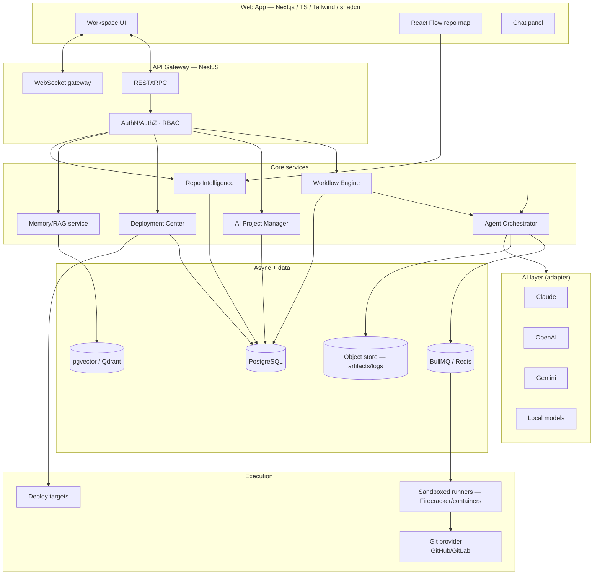
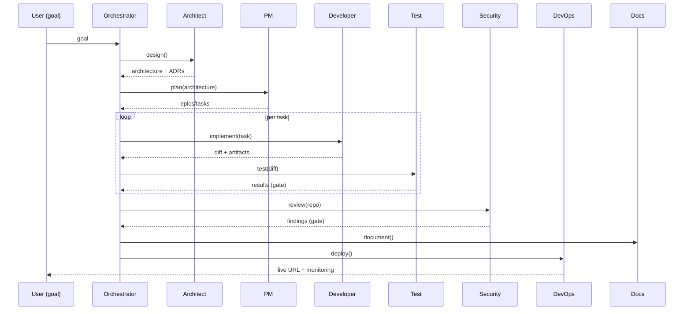
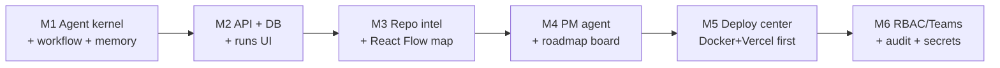

# MAERMIN Platform — Autonomous AI Software Engineering OS

> **Status:** Architecture + MVP kernel. This is a **new product**, distinct from
> the MAERMIN portfolio tracker. It must live in its own monorepo; the runnable
> seed in `platform/` is a provider-agnostic agent/workflow kernel that runs in
> Node today (no cloud services required), as the foundation for the full system.

This document covers deliverables 1–14. Deliverable 15 (first-version code) is the
`platform/` kernel, which is implemented and unit-tested.

---

## 0. Product thesis

A user states a **goal**. The platform runs it through a configurable pipeline of
**specialised agents** (Architect → PM → Developer → Test → Security → DevOps →
Docs), persists everything to a **project memory** (RAG), visualises the codebase
and plan, and can **deploy** — surfaced as a GitHub/Linear/Notion-like workspace,
not a chat window. Chat is one panel.

Competitive position: Devin (autonomy) × Cursor (edit loop) × Linear (planning) ×
Backstage (repo intelligence), with **pluggable model providers** and **portable
deployment**.

---

## 1. System architecture



**Principles:** stateless API pods (scale horizontally); all long work is a
**BullMQ job** in a sandboxed runner; the model provider is behind an **adapter**;
every artifact, decision and run is **persisted + embedded** for RAG.

---

## 2. Repository intelligence (visual project map)

Pipeline: **parse → graph → embed → render**.

- **Parse:** tree-sitter per language → symbols, imports, routes, DB models.
- **Graph:** build dependency graph (modules, files, symbols), API map (route →
  handler → service), data model (entities → relations), event flows.
- **Store:** graph in Postgres (`graph_nodes`, `graph_edges`); summaries embedded
  in pgvector.
- **Render:** **React Flow** (interactive module/service map, zoom/filter/search),
  **Mermaid** (architecture/ER/sequence export), **D3** (force-directed +
  heatmaps: churn, complexity, coverage).
- **Impact analysis:** given a change set, BFS the dependency graph to highlight
  affected nodes + tests to run.

---

## 3. AI memory & knowledge (RAG)

Layers (all per-project, tenant-scoped):

| Layer | Content | Store |
|------|---------|-------|
| Architecture | ADRs, decisions, standards | `documents` + pgvector |
| Development | coding standards, patterns, libs | `knowledge` + pgvector |
| User | preferences, tech stacks, goals | `knowledge` (kind=user) |
| History | sessions, tasks, commits, reviews | `events`/`runs` (+ embedded summaries) |

- **Embeddings:** provider-agnostic (`embed()` adapter); default `text-embedding-3`
  / local `bge`. Stored in **pgvector** (HNSW) — single datastore, no extra ops.
- **Retrieval:** hybrid (BM25 lexical + vector) → re-rank → context budget packer.
- **Write path:** every agent step writes a compact, embeddable summary
  (decision, diff rationale, test result) so the agent **never loses context**.
- **ADR automation:** Architect Agent emits ADR markdown on each significant
  decision; stored + linked to affected graph nodes.

---

## 4. One-click deployment center

Adapter per target (`DeployProvider` interface): `docker`, `vps(ssh)`,
`railway`, `render`, `fly`, `vercel`, `netlify`, `kubernetes`, `aws`, `azure`,
`gcp`. Each implements `provision`, `deploy`, `status`, `rollback`, `logs`.

Features: environment manager (per-env vars), **secrets** (sealed, KMS/age),
deployment history (immutable records), health checks, rollback to any prior
record, live logs via WS. Triggered from UI or as the final workflow stage.

---

## 5. AI project manager

- **Roadmaps:** project → epics → features → tasks → subtasks (tree).
- **Auto-planning:** PM Agent decomposes a goal into the tree with estimates.
- **Tracking:** status, velocity (rolling), burndown, ETA (Monte-Carlo over
  historical task durations).
- **Risk analysis:** detect bottlenecks (critical path), missing tests
  (coverage gaps from repo intel), tech debt (complexity/churn heatmap),
  security risks (Security Agent findings).
- **Recommendations:** next tasks, priority re-order, optimisations — surfaced as
  an inbox.

---

## 6. Multi-agent architecture



- **Agent contract:** `run(ctx) -> { artifacts, summary, decisions, status }`.
  Stateless; all state via `ctx` (memory + repo + task).
- **Gates:** Test and Security stages can **block** progression
  (`status: 'fail'`) → workflow pauses for human/auto-fix loop.
- **Tools:** agents call sandboxed tools (fs, git, shell, http) through a
  capability-scoped tool bus (RBAC + audit).
- **Configurable workflow:** stages are data (`WorkflowConfig`), so pipelines can
  be reordered, skipped, or parallelised per project.

---

## 7. Data model (PostgreSQL)

```dbml
Table users { id uuid pk; email text unique; name text; created_at timestamptz }
Table teams { id uuid pk; name text; owner_id uuid > users.id }
Table memberships { id uuid pk; team_id uuid > teams.id; user_id uuid > users.id; role text } // owner|admin|member|viewer
Table projects { id uuid pk; team_id uuid > teams.id; name text; repo_url text; default_branch text; created_at timestamptz }
Table workflows { id uuid pk; project_id uuid > projects.id; name text; config jsonb; enabled bool }
Table runs { id uuid pk; workflow_id uuid > workflows.id; goal text; status text; started_at timestamptz; finished_at timestamptz }
Table stages { id uuid pk; run_id uuid > runs.id; name text; agent text; status text; artifacts jsonb; summary text; idx int }
Table agents { id uuid pk; key text; role text; system_prompt text; provider text; model text }
Table tasks { id uuid pk; project_id uuid > projects.id; parent_id uuid > tasks.id; type text; title text; status text; estimate int; assignee_agent text }
Table documents { id uuid pk; project_id uuid > projects.id; kind text; title text; body text; embedding vector(1536) }
Table knowledge { id uuid pk; project_id uuid > projects.id; kind text; key text; value jsonb; embedding vector(1536) }
Table graph_nodes { id uuid pk; project_id uuid > projects.id; kind text; name text; meta jsonb }
Table graph_edges { id uuid pk; project_id uuid > projects.id; src uuid > graph_nodes.id; dst uuid > graph_nodes.id; kind text }
Table deployments { id uuid pk; project_id uuid > projects.id; target text; env text; status text; url text; rev text; created_at timestamptz }
Table secrets { id uuid pk; project_id uuid > projects.id; env text; name text; ciphertext bytea } // sealed
Table events { id uuid pk; project_id uuid > projects.id; actor text; type text; detail jsonb; at timestamptz } // audit
```

Indexes: pgvector HNSW on `documents.embedding`, `knowledge.embedding`; btree on
all FKs + `runs.status`, `tasks.status`. Row-level security per `team_id`.

---

## 8. API design (REST/tRPC + WS)

```
POST   /projects                         create
GET    /projects/:id/graph               repo intelligence graph
POST   /projects/:id/workflows           define a workflow (config)
POST   /workflows/:id/runs   {goal}      start a run  (202 + runId)
GET    /runs/:id                         run + stages + artifacts
WS     /runs/:id/stream                  live stage events / logs
GET    /projects/:id/tasks               roadmap tree
POST   /projects/:id/plan    {goal}      PM agent → tasks
POST   /projects/:id/memory/search {q}   hybrid RAG search
POST   /projects/:id/deployments {target,env}  deploy
POST   /deployments/:id/rollback         rollback
GET    /projects/:id/audit               audit log
```

Auth: OAuth/OIDC + session; per-route RBAC guard; all mutations audited.

---

## 9. Frontend structure (Next.js)

```
apps/web/
  app/(workspace)/[project]/
    overview/  map/  runs/[runId]/  tasks/  memory/  deployments/  settings/
  components/{flow,chat,diff,timeline,kanban,ui(shadcn)}
  lib/{api(react-query),ws,store}
```
Workspace shell (left nav: Overview · Map · Runs · Tasks · Memory · Deploys),
command palette, chat as a dockable panel. React Flow for the map; Monaco for
diffs; Mermaid for exported diagrams.

---

## 10. Folder structure (monorepo)

```
maermin-platform/                 (pnpm + turborepo)
  apps/
    web/                          Next.js workspace UI
    api/                          NestJS gateway + services
    runner/                       sandboxed job worker (BullMQ consumer)
  packages/
    agents/                       agent roles + orchestrator   ← seeded in platform/
    workflow/                     configurable pipeline engine ← seeded in platform/
    providers/                    AI adapter (claude/openai/gemini/local) ← seeded
    memory/                       RAG store + retrieval        ← seeded in platform/
    repo-intel/                   tree-sitter parsers + graph
    deploy/                       deployment adapters
    db/                           Prisma schema + migrations
    shared/                       types, zod schemas, utils
  infra/                          docker-compose, k8s, terraform
```

---

## 11. MVP roadmap



**M1 (this repo's `platform/`):** provider-agnostic agents, configurable
workflow engine, file/JSON memory, runnable + tested. **M2+:** add NestJS, Prisma/
Postgres, BullMQ runner, Next.js workspace.

---

## 12. Scaling strategy

- Stateless API → HPA on CPU/RPS. Long work → BullMQ; scale runner pool by queue
  depth. Postgres: read replicas + PgBouncer; pgvector HNSW; partition `events`/
  `stages` by month. Cache hot reads in Redis. Object store for artifacts/logs.
  Multi-tenant isolation via RLS; per-team rate limits + token budgets. Cost
  control: provider routing (cheap model for cheap stages), prompt caching,
  semantic dedupe of memory writes.

---

## 13. Security concept

- **AuthN:** OIDC; short-lived JWT + rotating refresh. **AuthZ:** RBAC
  (owner/admin/member/viewer) enforced by Nest guards + Postgres RLS.
- **Secrets:** sealed at rest (age/KMS), never returned to client, injected into
  runners just-in-time. **Sandbox:** agent tools run in ephemeral, network-egress-
  restricted containers; capability-scoped tool bus; no host fs access.
- **Supply chain:** Security Agent runs dependency audit + secret scanning +
  SAST on every run; SBOM generated. **Input:** zod validation at every boundary;
  output encoding; CSRF tokens; SSRF allow-lists on the http tool; path-traversal
  guards on the fs tool. **Audit:** append-only `events` for every action.

---

## 14. Implementation plan (phases) + priorities

| Phase | Deliverable | Priority |
|------|-------------|----------|
| **P0 (done)** | Agent kernel: adapter, configurable workflow, memory, tests | Must |
| P1 | NestJS API + Prisma/Postgres + auth + `runs` REST/WS | Must |
| P1 | Next.js workspace shell + Runs timeline (live WS) | Must |
| P2 | BullMQ runner + sandboxed tool bus (fs/git/shell/http) | Must |
| P2 | Repo intelligence (tree-sitter → graph) + React Flow map | High |
| P3 | RAG memory on pgvector (hybrid retrieval) | High |
| P3 | PM agent + roadmap/kanban + risk inbox | High |
| P4 | Deployment center (Docker + Vercel first, then fly/render) | Med |
| P4 | RBAC/teams + secrets + audit UI | Med |
| P5 | Remaining deploy targets, D3 heatmaps, local-model provider | Low |

**Prioritised task list (first 12):**
1. Provider adapter + Mock/Claude/OpenAI 2. Workflow engine (stages/gates) (done)
3. Agent roles + orchestrator 4. Memory store + retrieval interface (done)
5. Engine tests 6. Prisma schema (§7) 7. NestJS `runs` module + WS stream
8. Next.js Runs view 9. BullMQ runner + tool bus 10. tree-sitter repo graph
11. React Flow map 12. PM agent + roadmap board.

---

## 15. First-version code

See `platform/` — a runnable, dependency-free Node kernel implementing the
adapter pattern, the configurable multi-agent workflow engine (Idea → … → Deploy
with blocking gates), and a file-based memory, with a passing test suite
(`cd platform && npm test`). It is the literal seed of `packages/{providers,
workflow,agents,memory}` above.
